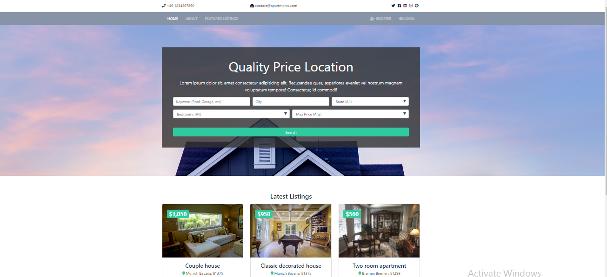
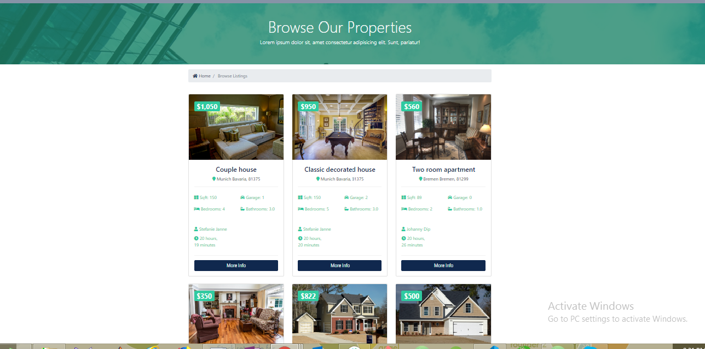
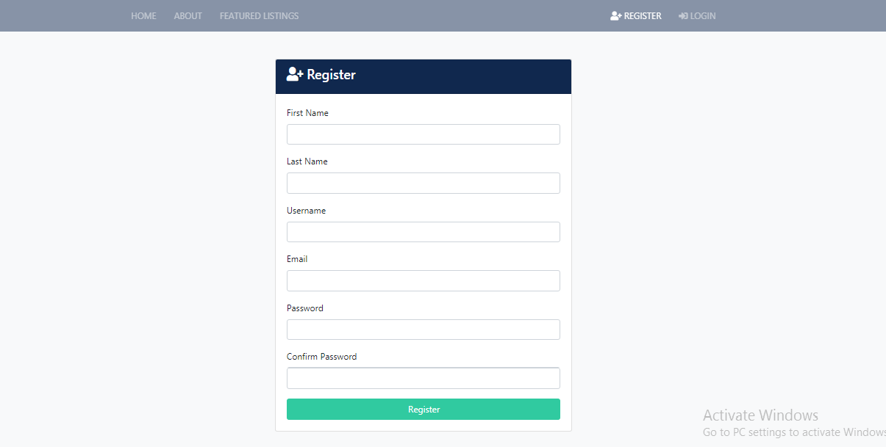
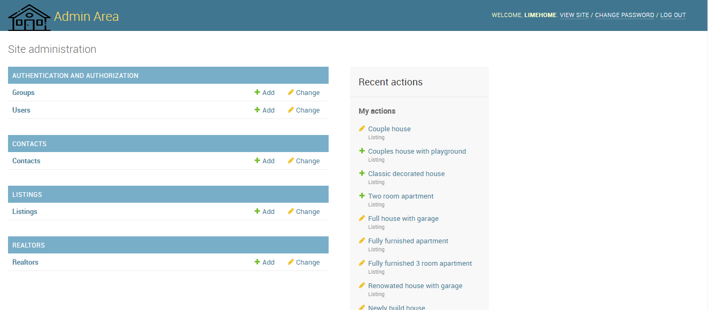
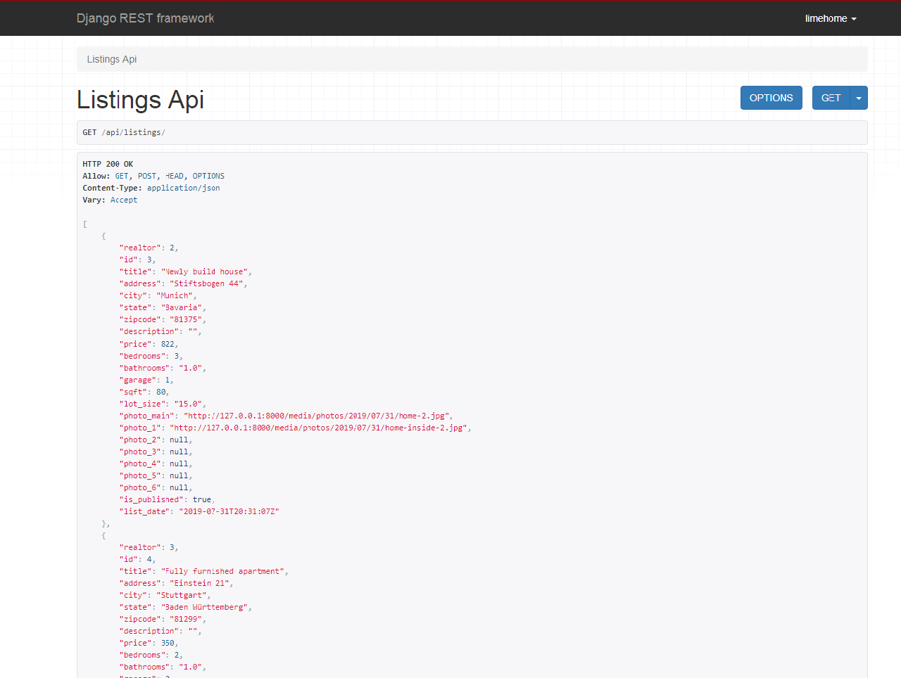
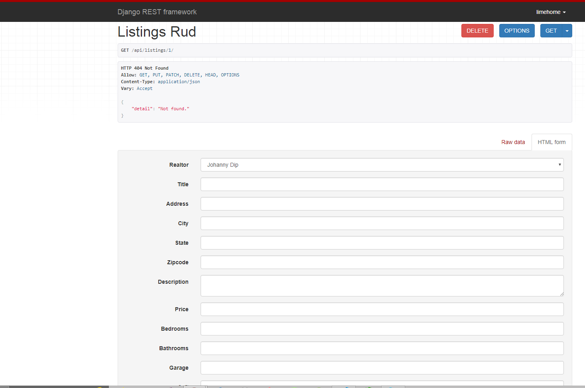

# Apartments/Houses Renting Web Application

Full stack web application for apartment/houses search  

> Django==2.2.3  
> Django Rest Framework==3.10.2
> Pillow==5.2.0      
> psycopg2==2.7.5     
> sycopg2-binary==2.7.5    
> markdown==3.1.1      
> djangofilter==2.2.0        

## Web App Features
### FRONTEND PAGES

- Home   
- About
- Listings
- Single Listing
- Search   
- Register    
- Login    
- Dashboard (Inquiries)      

### DESIGN SPECIFICATION     

- Use Any Logo (Frontend and admin)
- Branding colors - blue(#10284e) green(#30caa0)
- Mobile Friendly
- Social media icons & contact information

### FUNCTIONALITY SPECIFICATION

- Manage listings, realtors, contact inquiries and website users via admin
- Role based users (staff and non-staff)
- Display listings in app with pagination
- Ability to set listings to unpublished
- Search listings by keyword, city, state, bedrooms and price (Homepage & search page)
- List realtors on about page with “seller of the month” (Control via admin)
- Listing page should have fields listed below
- Listing page should have 5 images with lightbox
- Lightbox should scroll through images
- Listing page should have a form to submit inquiry for that property listing
- Form info should go to database and notify realtor(s) with an email
- Frontend register/login to track inquiries
- Both unregistered and registered users can submit form. If registered, can only submit one per listing

### LISTING PAGE FIELDS

- Title          
- Address, city, state, zip    
- Price    
- Bedrooms   
- Bathrooms    
- Square Feet    
- Lot Size   
- Garage    
- Listing Date    
- Realtor – Name & Image     
- Main image and 5 other images   

### BACKEND

> Database 'Postgres'      
> Database Name:     

## Screenshots
- HOME 

     

- LISTING     

     

- REGISTER     

    

- LOGIN   

      

- ADMIN  

- LISTING API

 - LISTING RUD API

